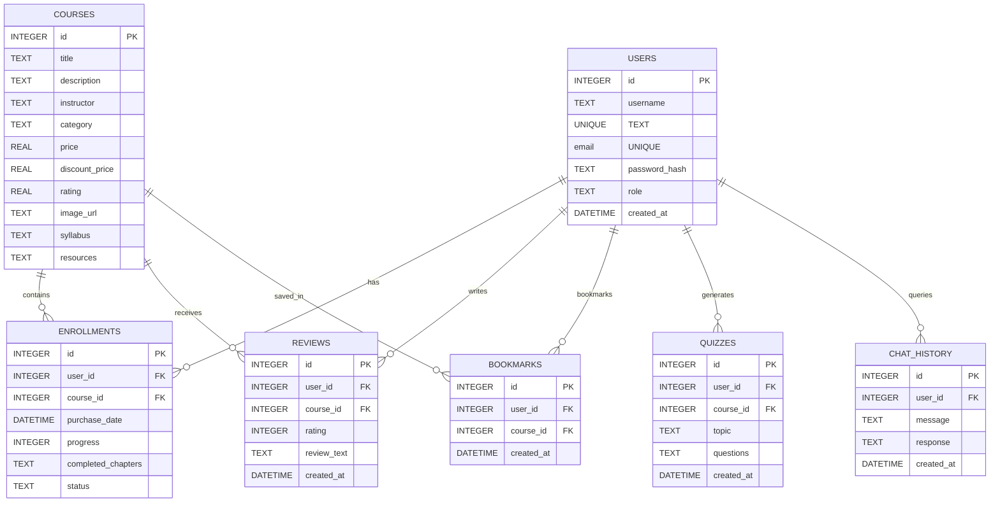

# AI LearnHub SQLite Schema & Relationships

This document outlines the SQLite relational database schema designed for the AI LearnHub platform.

---

## 📊 Database ER Diagram

---

## 🗄 Table Schemas

### 1. `users`
Stores student accounts.
* `id`: `INTEGER PRIMARY KEY AUTOINCREMENT`
* `username`: `TEXT NOT NULL UNIQUE`
* `email`: `TEXT NOT NULL UNIQUE`
* `password_hash`: `TEXT NOT NULL`
* `role`: `TEXT DEFAULT 'student'` (student, admin)
* `created_at`: `DATETIME DEFAULT CURRENT_TIMESTAMP`

### 2. `courses`
Stores course details. Syllabus and Resources are saved as JSON strings.
* `id`: `INTEGER PRIMARY KEY AUTOINCREMENT`
* `title`: `TEXT NOT NULL`
* `description`: `TEXT NOT NULL`
* `instructor`: `TEXT NOT NULL`
* `category`: `TEXT NOT NULL` (e.g. `Software Engineering`)
* `price`: `REAL NOT NULL`
* `discount_price`: `REAL NULL`
* `rating`: `REAL DEFAULT 5.0`
* `image_url`: `TEXT NULL`
* `syllabus`: `TEXT NOT NULL` (JSON array of chapter objects)
* `resources`: `TEXT NULL` (JSON array of downloadable files)

### 3. `enrollments`
Tracks active course purchases.
* `id`: `INTEGER PRIMARY KEY AUTOINCREMENT`
* `user_id`: `INTEGER FOREIGN KEY REFERENCES users(id) ON DELETE CASCADE`
* `course_id`: `INTEGER FOREIGN KEY REFERENCES courses(id) ON DELETE CASCADE`
* `purchase_date`: `DATETIME DEFAULT CURRENT_TIMESTAMP`
* `progress`: `INTEGER DEFAULT 0` (percentage 0-100)
* `completed_chapters`: `TEXT DEFAULT '[]'` (JSON array of integer chapter IDs)
* `status`: `TEXT DEFAULT 'active'` (`active`, `completed`)
* **Constraints**: `UNIQUE(user_id, course_id)` (prevents double purchase)

### 4. `reviews`
Stores student course evaluations.
* `id`: `INTEGER PRIMARY KEY AUTOINCREMENT`
* `user_id`: `INTEGER FOREIGN KEY REFERENCES users(id) ON DELETE CASCADE`
* `course_id`: `INTEGER FOREIGN KEY REFERENCES courses(id) ON DELETE CASCADE`
* `rating`: `INTEGER NOT NULL CHECK(rating BETWEEN 1 AND 5)`
* `review_text`: `TEXT NULL`
* `created_at`: `DATETIME DEFAULT CURRENT_TIMESTAMP`

### 5. `bookmarks`
Tracks course saves.
* `id`: `INTEGER PRIMARY KEY AUTOINCREMENT`
* `user_id`: `INTEGER FOREIGN KEY REFERENCES users(id) ON DELETE CASCADE`
* `course_id`: `INTEGER FOREIGN KEY REFERENCES courses(id) ON DELETE CASCADE`
* `created_at`: `DATETIME DEFAULT CURRENT_TIMESTAMP`
* **Constraints**: `UNIQUE(user_id, course_id)`

### 6. `quizzes`
Stores generated AI multiple choice quizzes.
* `id`: `INTEGER PRIMARY KEY AUTOINCREMENT`
* `user_id`: `INTEGER FOREIGN KEY REFERENCES users(id) ON DELETE CASCADE`
* `course_id`: `INTEGER NULL FOREIGN KEY`
* `topic`: `TEXT NOT NULL`
* `questions`: `TEXT NOT NULL` (JSON array of questions, options, answers, and explanations)
* `created_at`: `DATETIME DEFAULT CURRENT_TIMESTAMP`

### 7. `chat_history`
Maintains AI study assistant dialogues.
* `id`: `INTEGER PRIMARY KEY AUTOINCREMENT`
* `user_id`: `INTEGER FOREIGN KEY REFERENCES users(id) ON DELETE CASCADE`
* `message`: `TEXT NOT NULL`
* `response`: `TEXT NOT NULL`
* `created_at`: `DATETIME DEFAULT CURRENT_TIMESTAMP`
